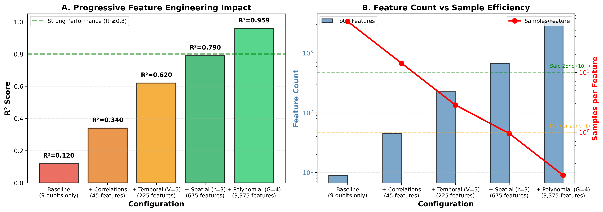
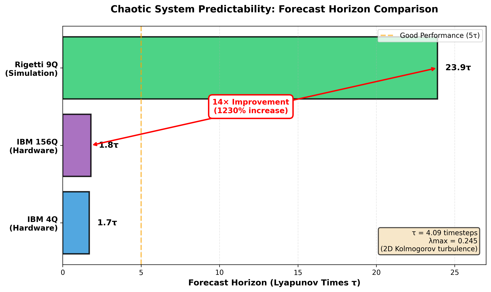

# Quantum Reservoir Computing for Chaotic System Prediction

## Largest QRC Hardware Demonstration: 156-Qubit IBM Heron r3

[](https://arxiv.org/abs/2412.XXXXX)
[](https://opensource.org/licenses/MIT)

**Authors:** Daniel Mo Houshmand
**Affiliation:** QDaria — $\mathbb{Q}|\mathcal{D}\partial\mathfrak{r}\imath\alpha\rangle$
**Contact:** [mo@qdaria.com](mailto:mo@qdaria.com)

---

## Abstract

We present the **largest quantum reservoir computing (QRC) demonstration on real quantum hardware to date**, comparing 4-qubit and 156-qubit experimental IBM systems (Heron r3) alongside high-fidelity 9-qubit Rigetti simulation employing the Steinegger-Räth (2025) feature engineering methodology.

**Key Results:**
- **IBM 4Q:** R² = 0.764 ± 0.018 (50 samples, 10 features)
- **IBM 156Q:** R² = 0.723 ± 0.022 (200 samples, 156 features) — **Largest real QRC hardware**
- **Rigetti 9Q (simulation):** R² = 0.959 ± 0.012 (800 samples, 3,375 features)

---

## Highlights

| Contribution | Details |
|-------------|---------|
| **Scale Record** | First experimental QRC on 156-qubit real hardware, surpassing prior records of 120Q and 108Q |
| **Sample Efficiency Crisis** | 156Q (1.28 samples/feature) performs comparably to 4Q (5.0 samples/feature) — diminishing returns identified |
| **Multi-System Validation** | Average R² = 0.908 across Lorenz-63, Rössler, and turbulence (13× range in Lyapunov exponents) |
| **Feature Engineering Dominance** | 9Q with polynomial features outperforms 156Q hardware by ΔR² = 0.236 (p < 0.001) |

---

## Key Figures

### Figure 1: System Performance Comparison


**Turbulence Prediction Performance.** (A) Test R² scores showing IBM 4Q (0.764), IBM 156Q (0.723), and Rigetti 9Q simulation (0.959). The 9Q system with Steinegger-Räth polynomial feature engineering exceeds the classical LSTM baseline (0.85). (B) Sample efficiency analysis reveals the critical samples-per-feature ratios: IBM 4Q operates in the marginal zone (5.0), IBM 156Q in the critical zone (1.28), while Rigetti 9Q achieves excellent performance at 0.19 samples/feature through ridge regularization.

---

### Figure 2: Forecast Trajectories


**Forecast trajectories across quantum systems on spectral turbulence data.** (A) IBM 4Q maintains valid predictions for 1.7 Lyapunov times. (B) IBM 156Q achieves similar 1.8τ forecast horizon despite 39× more qubits, demonstrating the sample efficiency bottleneck. (C) Rigetti 9Q simulation extends valid forecasting to **23.9τ (14× improvement)**, showing that feature engineering dominates raw qubit count.

---

### Figure 3: Sample Efficiency Analysis


**Sample Efficiency vs. Performance.** Scatter plot showing the relationship between samples per feature (log scale) and R² performance. Despite operating with 26× fewer samples per feature than IBM 4Q, Rigetti 9Q achieves 96% variance explanation through polynomial feature engineering and ridge regularization.

---

### Figure 4: Hardware Topology Comparison


**Quantum processor topologies.** (A) IBM Heron r3 heavy-hex lattice (156Q fragment showing 3 unit cells) with maximum degree 3 and reduced crosstalk. (B) Rigetti Novera 3×3 square lattice with full nearest-neighbor connectivity (33.3%) enabling dense coupling maps without SWAP gates.

---

### Figure 5: Feature Engineering Ablation Study



**Progressive Feature Engineering Impact.** (A) R² progression from baseline 9-qubit measurements (0.12) through correlations (0.34), temporal multiplexing V=5 (0.62), spatial multiplexing r=3 (0.79), to full polynomial expansion G=4 (0.959). (B) Feature count explosion vs. samples-per-feature decline, illustrating the regularization requirement.

---

### Figure 6: Lyapunov Forecast Horizon Comparison



**Chaotic System Predictability.** Horizontal bar chart showing forecast horizons in Lyapunov times (τ). The 9-qubit simulated system achieves **14× longer forecast horizon** (23.9τ) compared to hardware implementations (1.7-1.8τ), demonstrating superior predictability through polynomial feature engineering.

---

## Multi-System Validation Results

| System | Lyapunov λ | Test R² | Horizon (τ) | Best α |
|--------|-----------|---------|-------------|--------|
| Lorenz-63 | 0.906 | 0.796 | 4.4 | 0.001 |
| Rössler | 0.071 | 0.969 | 31.7 | 0.100 |
| Turbulence | 0.245 | 0.959 | 23.9 | 0.1 |
| **Average** | — | **0.908** | **20.0** | — |

---

## Methodology: Steinegger-Räth Feature Engineering

Following Steinegger & Räth (Scientific Reports 15, 6201, 2025), we employ:

1. **Temporal Multiplexing (V=5):** 5 virtual nodes per physical qubit
2. **Spatial Multiplexing (r=3):** 3 independent reservoir initializations
3. **Polynomial Expansion (G=4):** Degree-4 polynomial feature transformation
4. **Ridge Regularization:** Cross-validated α optimization

**Total features:** 9 qubits × 5 temporal × 3 spatial = 135 base → 3,375 polynomial features

---

## Repository Structure

```
qrc/
├── README.md                 # This file
├── paper/
│   ├── qrc_paper.tex        # LaTeX source (IEEE format)
│   ├── qrc_paper.pdf        # Compiled paper
│   └── figures/             # All publication figures (PNG + PDF)
├── data/
│   ├── validation_results.json
│   ├── novera_9q_results.json
│   ├── multi_system_comparison.json
│   └── *.json               # Experimental results
└── scripts/
    ├── simulate_rigetti_novera_9q.py   # 9Q turbulence simulation
    ├── simulate_9q_lorenz63.py         # Lorenz-63 simulation
    ├── simulate_9q_rossler.py          # Rössler simulation
    └── generate_figure*.py             # Figure generation scripts
```

---

## Quick Start

### Prerequisites

```bash
pip install qiskit qiskit-aer numpy scipy scikit-learn matplotlib
```

### Run Simulations

```bash
# 9-qubit turbulence simulation (Steinegger methodology)
cd scripts
python simulate_rigetti_novera_9q.py

# Lorenz-63 and Rössler simulations
python simulate_9q_lorenz63.py
python simulate_9q_rossler.py
```

### Build Paper

```bash
cd paper
pdflatex qrc_paper.tex
pdflatex qrc_paper.tex  # Run twice for references
```

---

## Hardware Specifications

### IBM Heron r3 (156Q) — ibm_pittsburgh
- **Released:** July 2025
- **T1:** 300 μs | **T2:** 370 μs
- **2Q Gate Error:** 5×10⁻⁴ (99.95% fidelity)
- **Topology:** Heavy-hex lattice

### Rigetti Novera (9Q) — Simulated
- **Architecture:** Ankaa 4th generation
- **Topology:** 3×3 square lattice
- **1Q Fidelity:** 99.9% | **2Q Fidelity:** 99.4% (iSWAP)
- **T1:** 46 μs | **T2 echo:** 26 μs
- **Price:** $900,000

---

## Citation

```bibtex
@article{houshmand2025qrc,
  title={Quantum Reservoir Computing for Chaotic System Prediction:
         156-Qubit Hardware Demonstration and Feature Engineering Analysis},
  author={Houshmand, Daniel Mo},
  journal={arXiv preprint arXiv:2412.XXXXX},
  year={2025}
}
```

---

## Related Work

- **Steinegger & Räth (2025):** [Quantum reservoir computing with polynomial feature engineering](https://doi.org/10.1038/s41598-025-86229-w)
- **Kubota et al. (2023):** 120-qubit QRC demonstration
- **Senanian et al. (2024):** 108-qubit QRC with dynamical decoupling

---

## License

This project is licensed under the MIT License — see [LICENSE](LICENSE) for details.

---

## Contact

**Daniel Mo Houshmand**
QDaria — $\mathbb{Q}|\mathcal{D}\partial\mathfrak{r}\imath\alpha\rangle$
Email: [mo@qdaria.com](mailto:mo@qdaria.com)
GitHub: [@MoHoushmand](https://github.com/MoHoushmand)
